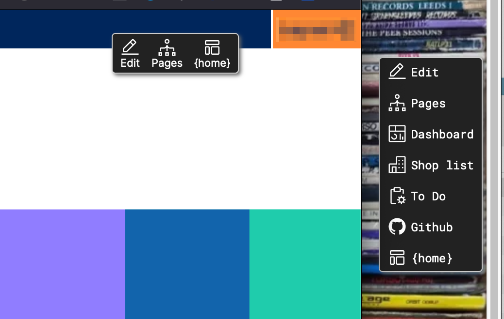

# MillcoUtils

Very early (not really ready for public consumption) and very opinionated ProcessWire module that does a couple of useful things that I like to have across most sites.

One day it might have some more useful things.

I was spurred into action to put these things into a module by Bernhard's [RockFrontend](https://processwire.com/modules/rock-frontend/) module. That's a lot fancier than this is ever likely to be so go and check that out.

# Things it does so far.

## Edit bar

Adds an edit link and link to the page tree to front end pages for logged in users. Superusers also get a link to edit the template. This behaves in a simlar fashion to Bernhard's RockFrontend edit bar. You can set the inital position of the toolbar in admin now (it can be dragged when editing a page as well.)

You can also add buttons by adding a link, label and icon to the relevant config field. 

At the moment I've got a limited number of icons included but you can add more or I probably will when I'm adding them. The ones I'm using at the mo are the IBM Carbon icons [grabbed from here](https://icon-sets.iconify.design/carbon/)   

## Nonce

Adds a nonce property to your page which you can add to your [Content Security Policy](https://developer.mozilla.org/en-US/docs/Web/HTTP/CSP) (CSP) and then inline script / styles.

    // Add your CSP metatag with the script nonce value set to $mu->nonce  

	<meta http-equiv="Content-Security-Policy" content=" default-src  'self' https://cdn.usefathom.com/ https://www.youtube.com https://www.youtube-nocookie.com ; font-src 'self' ; style-src 'self' 'unsafe-inline'; script-src 'self' https://cdn.usefathom.com/ 'nonce-<?=$mu->nonce?>'; img-src * data: ;">

	// This means that only scripts with the same nonce property will be allowed to run. 
	// Any inline scripts that get added to your site via nasty comment markup or whatever will be prevented from running.  

	

The nonce this module creates is available both as:

	$page->nonce

and

	$mu->nonce

I really recommend using a CSP if you don't already.

## Inline icons

	$mu->file_icon('whatever');

will inline an svg file with the name whatever.svg if it exists in the site/assets/images/ or a folder relative to that if you've configured it. NB this used to default to images/icons so if you update you might need to specify the 'icons' folder now.
 
We normally use 'currentColor' in SVGs loading this way.

	// A link with an inlined SVG icon with the fill set to currentColor will
	// pick up the text colour you've set for links and hover states in CSS  

	<a href="/">Link with icon <?=$mu->file_icon('heart')?></a>

## Source set and defaults for image markup

	$mu->source_set($image);

Source set is pushing it a bit, but if you pass an image to $mu->source_set() then we'll wrap it in a picture element with webp and original versions of the image. 

We also create a smaller version of the image for mobile devices.

The function takes an image, optional width and height and then an array of various options:

	echo $mu->source_set($page->featured_image, 640, 480, ["class" => " card_image", "no_caption" => 1,  "not_lazy" =>1, "quality" => "high", "upscale" => 1 ]);

The function checks for a custom image field 'image_caption' and will wrap the picture element in figure tags with a caption.

Alt text is pulled from either an 'image_alt' field or the img 'description' value.

# Millco Utils Textformatter

The module now also installs a TextFormatter. If you add this to a text field then it replaces inline images with a source set and tidies up some tags that TinyMCE puts in but shouldn't.

# Analytics tag

You can include either a Cabin Analytics or Fathom Analytics tag (or hey, both if you want) by providing the necessary details in the module options.

# Ajax endpoints

Adding php files to an /ajax/ folder in your templates directory will automatically create URL hooks for them. e.g. adding a hello-world.php file will create a URL at yousite.com/ajax/hello-world  
It's really simple and that's all it does, so if you're using it for ajax you'll need to handle the response in your own file. 
Benhard's [RockFrontend](https://processwire.com/modules/rock-frontend/) module has much a fancier and more configurable version of this.

# Things it doesn't yet but will soon.

- [ ] Configurable CSP
- [ ] Automatic page reload that got mentioned in the PW forum.
- [ ] Wire in our holding page maybe.

stephen at [millipedia.com](https://millipedia.com)